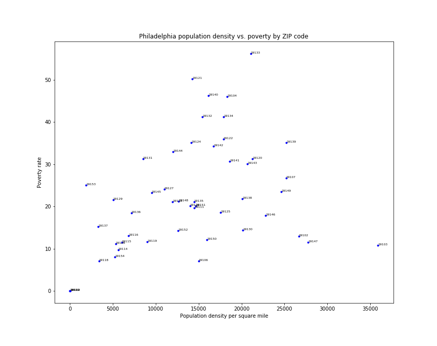

# Poverty vs. population density in Philadelphia

A scatterplot analysis of the relationship between poverty and population density in Philadelphia, Pennsylvania. Each dot represents a ZIP Code Tabulation Area (ZCTA) and is labeled with its five-digit ZIP code.

Program uses pandas.read_csv to read the data and matplotlib.pyplot to render a figure which is saved as a .PNG file.

The population data are from the U.S. Census Bureau's 2013-2017 American Community Survey 5-Year Estimates (https://factfinder.census.gov/faces/tableservices/jsf/pages/productview.xhtml?src=bkmk).

To calculate density, land areas of ZCTAs were taken from the 2018 U.S. Gazetteer files for ZIP Code Tabulation Areas (https://www.census.gov/geographies/reference-files/time-series/geo/gazetteer-files.html).
